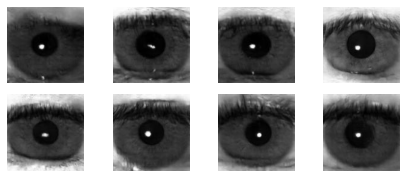

# Sample Picking in Synthetic Irises for Wolf Attacks

This repository contains the code and resources for our research project, "**Sample Picking in Synthetic Irises for Wolf Attacks**." Our study aims to identify and select synthetic iris images that are most likely to succeed in bypassing iris recognition systems, often known as "**wolf attacks.**"

<figure>
<p align="center">
  
</p>
</figure>
<p align="center" >Examples of generated synthetic iris images</p>

Our approach involves:

1. **Generating Synthetic Iris Images**: We use Deep Convolutional Generative Adversarial Networks (**DCGAN**) to create a wide range of synthetic iris images.

2. **Rejection Sampling**: The generated images are filtered based on the Presentation Attack Detection [(D-NetPAD)](https://github.com/iPRoBe-lab/D-NetPAD) score distributions of real iris images.

3. **Evaluating Synthetic Images**: For each synthetic iris image, we calculate the probability of zero success in all attack attempts, using match and non-match score distributions from the training set of real iris images.

4. **Selecting the Most Promising Samples**: The synthetic images with the lowest probabilities of zero success (highest chances of succeeding in an attack) are picked for the final set.

We put our hypothesis to the test that this specifically curated set would be more effective in performing wolf attacks compared to randomly selected samples. This repository provides the tools and resources to replicate our experiment, contributing to the ongoing discussion on the security of iris recognition systems.

Please feel free to explore the code and the documentation, and we appreciate any feedback or contributions to improve this project.

_Note_: The [VeriEye] system was utilized for conducting presentation attacks. Additionally, the same system was employed to extract irises from images.

## Requirements

`Python version = 3.9.1`

1. Use `pip install poetry` command to install poetry if you don't have it.
2. Install all the necessary packages using `poetry install` command.

### Downloads

**Data**: [Click here](https://mega.nz/file/lroE2ZZa#bo6SXCGXD2x4ATDOzlV0wu6QGLMI67_4n4e_N1wCEA8) to download data.

**Models**: [Click here](https://mega.nz/file/F2BwnKwK#2QxfyN--om5JgyyW9flBVAi4MF-pDm9gjn2IZZfGnmM) to download models.

## Content

Here's a brief overview of the key components:

-   **Data**: Contains the synthetic and real iris images used for the study, along with associated information like PAD scores and match scores.

    -   **figures** -> Figures used in the paper.

    -   **info**

        -   **synthetic.json** -> Contains the pad scores of synthetic images, match scores with iris images in the training dataset, whether they passed the pad and data screening, and their prop_of_i (probability of being an impostor).
        -   **synthetic_pairs.json** -> Contains the same data as synthetic.json, with the additional information on which training iris image the iris match scores belong to.
        -   **train.json** -> Contains the fold, identity, iris boundary points determined by VeriEye, and pad score data of the images in the training set.

    -   **synthetic** -> Contains synthetic iris images generated in all folds.

        -   Naming: X_Y, X => Fold, Y => Image number

    -   **train** -> Contains iris images in the training dataset, images are foldered based on identity. Left and right eyes are taken as separate identities.

-   **Models**: Contains the trained GAN models for each fold of data.
-   **Pad**: Contains the D-NetPad algorithm and its trained model, which is used for obtaining PAD scores.
-   **Notebooks**: Includes all the notebooks used for the experiments. Each notebook serves a different purpose, including data preparation, attack elimination, experiment execution, and result production.

    -   **attack_elimination.ipynb** -> Calculates the probability of synthetic iris images being impostors. Contains codes for attack elimination processes. The 400 with the highest probability are considered to have passed the elimination.

    -   **attack_experiments.ipynb** -> Contains codes for producing the results of attack experiments.

    -   **pad_elimination.ipynb** -> Contains codes for synthetic image generation and pad elimination processes. The elimination process is carried out by selecting a random point within the normal distribution. (Rejection sampling)

    -   **pad_experiments.ipynb** -> Contains codes for producing the results of PAD experiments.

    -   **report.ipynb** -> Contains codes needed to produce data and figures for reporting.

    -   **training.ipynb** -> Contains codes for training the GAN model.

    -   **verieye.ipynb** -> Contains the codes for the graph of matching score distributions of matched and unmatched irises.

[VeriEye]: https://www.neurotechnology.com/verieye.html

## Citation

If you find this repository useful in your research, please cite our paper:

```
@inproceedings{synthetic_iris_dcgan,
  author={Akdeniz, Eyüp Kaan and Erdoğmuş, Nesli},
  booktitle={2023 31st Signal Processing and Communications Applications Conference (SIU)}, 
  title={Sample Picking in Synthetic Irides for Wolf Attacks}, 
  year={2023},
  pages={1-4},
  doi={10.1109/SIU59756.2023.10223964}}
```
